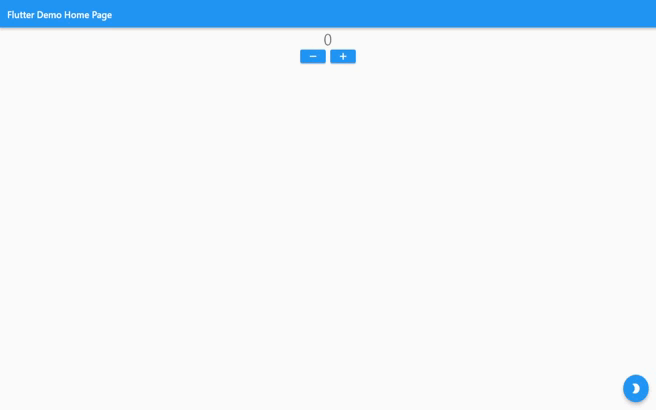

# Практическая работа №4

### Тема: Создать проект с использованием Cubit.

#### Цель работы: Создать проект с использованием Cubit.

#### Реализовать счетчик при нажатии на кнопку + осуществляет увеличение счетчика, при нажатии на кнопку - осуществляться уменьшение счетчика.

#### Если текущая тема устройства светлая то за одно нажатие должно +1 или -1.

#### Если текущая тема устройства темная то за одно нажатие должно  +2 или -2.

#### Каждое действие должно записываться в историю. История должна быть реализована через виджет ListView

#### Ход работы:

#### Демонстрация работы, Подробное описание практической работы можно увидеть в отчете, который загружен в ClassRoom

#### Вывод: в данной практической работе был разработан проект с использованием Cubit.
