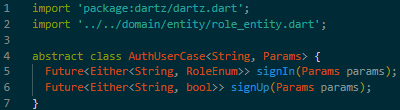
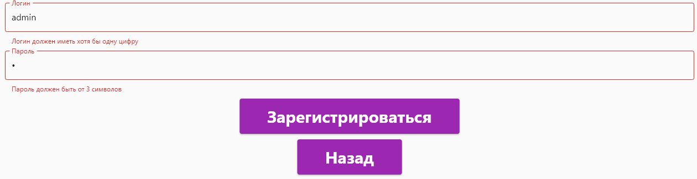

# ПРАКТИЧЕСКАЯ РАБОТА №3

### Реализовать регистрацию и авторизацию пользователя.

### Каждое поле на экране авторизации и регистрации провалидировать минимум 3 критериями максимум 5.

### После успешной авторизации перейти на экран в зависимости от роли пользователя.

### Если авторизация или регистрация не удалась нужно вывести сообщение при помощи Snack Bar.

### Цель работы: реализовать регистрацию и авторизацию пользователя.

### Ход работы:

### Для начала работы с авторизацией и регистрации необходимо скачать следующие библиотеки:

### Рисунок 1 - библиотеки

### В папке core создаем папку usercase, здесь создаем файл auth

 
 
### Рисунок 2 - auth.dart

### В папке data создаем папку repository, здесь файл auth_repositories_impl

 
 
### Рисунок 3 - auth_repositories_impl.dart

### Далее необходимо изменить role_entity:

 
 
### Рисунок 4 - role_entity.dart

### В папке entity создаем папку usercases, здесь файл auth

 
 
### Рисунок 5 - auth.dart

 

### Рисунок 6 - authRepository.dart

### Далее создаем папку screens, в ней файлы, в которых будет верстка авторизации, регистрации и окон для админа с пользователем.

 
 
### Рисунок 7 – screens

 
 
### Рисунок 8 - окно регистрации с валидацией

 
 
### Рисунок 9 - окно авторизации с валидацией

 
 
### Рисунок 10 - окно админа

### Рисунок 11 - окно пользователя

### Рисунок 12 - пользователи в бд
 
### Вывод: в данной практической работе была реализована авторизация и регистрация для пользователей, также каждое поле на экране авторизации и регистрации было провалидированно.
